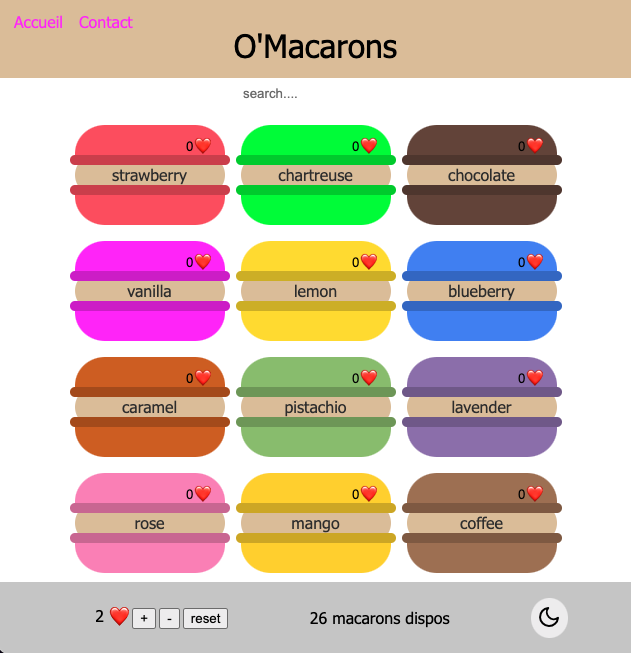

# O'Macarons

Support pour la trame des saisons 15 et 16 : https://laughing-disco-2kr9olr.pages.github.io/#/projects/2

Le code de chaque jour est dans une branche différente.

- S15E01 : Découverte React, state et rendu de listes
- S15E02 : Découpage en sous composants et props
- S15E03 : Formulaires 
- S15E04 : Effets de bord, call API
- S16E01 : React Router
- S16E03 : Context

